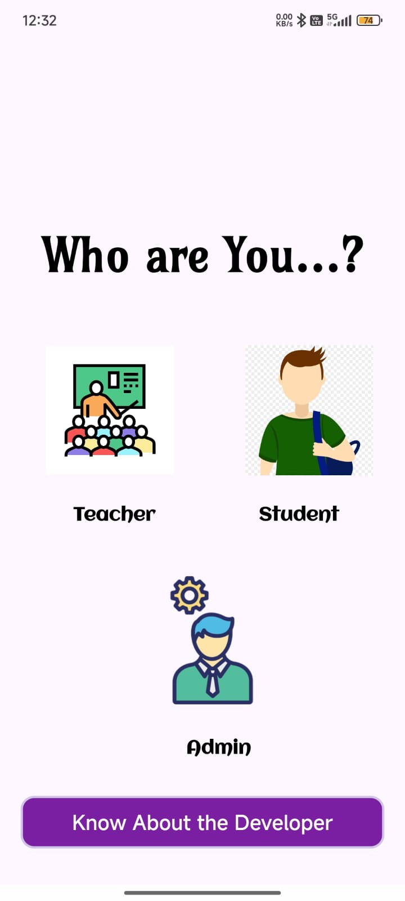
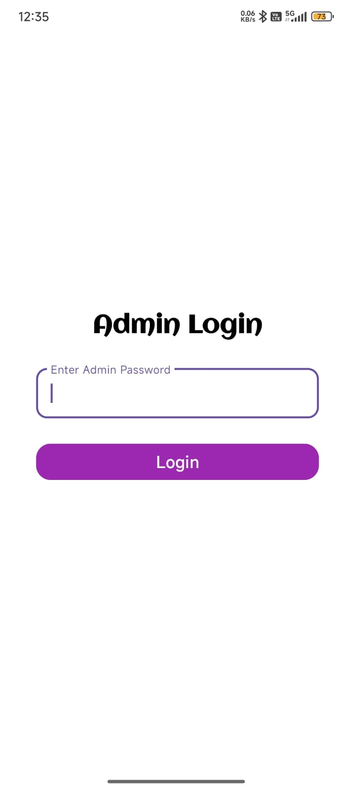
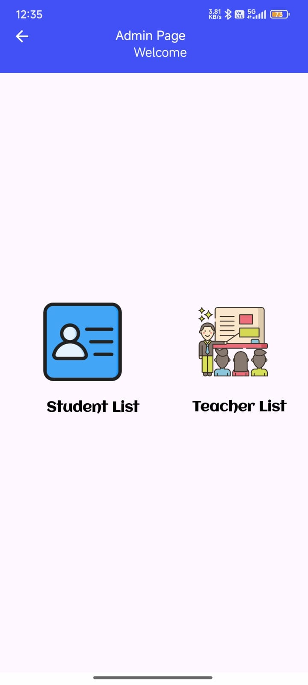
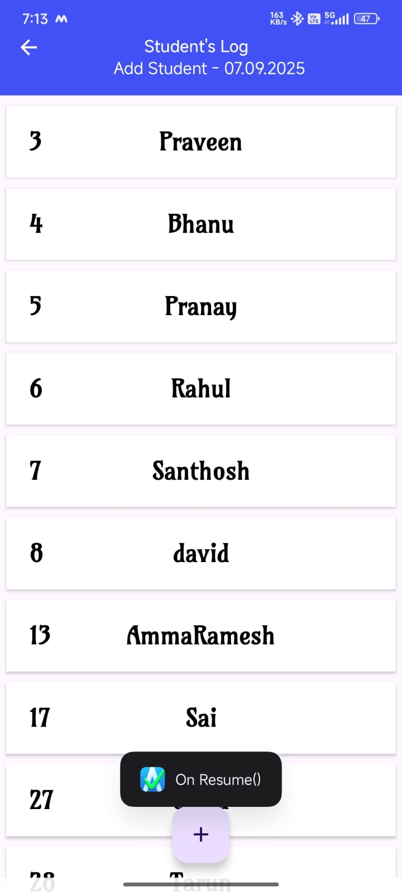
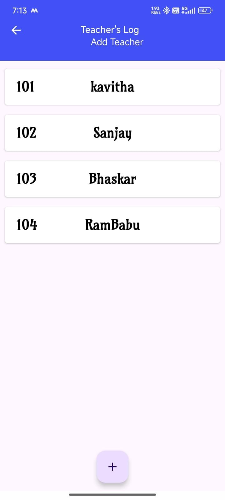

<h1>📌 MarkMe-UltimateApp</h1>

✨ <b>An easy-to-use application that provides a seamless experience for marking student attendance automatically.</b>

The app has <b>three roles</b>:

<ul>
  <li>👨‍💼 <b>Admin</b></li>
  <li>👨‍🏫 <b>Teacher</b></li>
  <li>👩‍🎓 <b>Student</b></li>
</ul>

<h2>👨‍💼 Admin Role</h2>

The <b>Admin</b> is responsible for setting up the system before others can use it.

<b>Responsibilities:</b>
<ul>
  <li>➕ Add <b>Students</b> with a unique <code>rollNumber</code></li>
  <li>➕ Add <b>Teachers</b> with a unique <code>Password</code></li>
</ul>

<h2>👨‍🏫 Teacher Role</h2>

The <b>Teacher</b> is the main user of the system.

<b>Responsibilities:</b>
<ul>
  <li>🏫 Create a <b>Class</b> with <code>className</code> and <code>subjectName</code></li>
  <li>📂 Navigate to the <b>current class</b></li>
  <li>✅ Mark attendance for students</li>
  <li>📊 Access the <b>Ultimate Attendance Sheet</b> & Download it</li>
</ul>

<h2>👩‍🎓 Student Role</h2>

The <b>Student</b> uses the app to track their attendance.

<b>Responsibilities:</b>
<ul>
  <li>🔑 Login with credentials</li>
  <li>👀 Navigate to <b>Show Attendance</b></li>
  <li>📈 Check <b>Attendance Percentage</b></li>
</ul>

<h3>🚀 With <b>MarkMe-UltimateApp</b>, attendance management becomes <i>smarter, faster, and fully automated!</i></h3>

  <h2>👨‍💻Admin Field</h2>
  
  
  
  
  
  

