<h1 align="center">📌 MarkMe - UltimateApp</h1>

✨ <b>An easy-to-use application that provides a seamless experience for marking student attendance automatically.</b> 
<i>Smarter • Faster • Automated</i>

  
  
  

---

## 🌟 App Roles

- 👨‍💼 **Admin**
- 👨‍🏫 **Teacher**
- 👩‍🎓 **Student**

---

## 👨‍💼 Admin Role
The **Admin** sets up the system before others can use it.

**Responsibilities**
- ➕ Add **Students** with a unique `rollNumber`  
- ➕ Add **Teachers** with a unique `Password`  

---

## 👨‍🏫 Teacher Role
The **Teacher** is the main user of the system.

**Responsibilities**
- 🏫 Create a **Class** (`className`, `subjectName`)  
- 📂 Navigate to the **current class**  
- ✅ Mark student attendance  
- 📊 Access & Download the **Ultimate Attendance Sheet**  

---

## 👩‍🎓 Student Role
The **Student** uses the app to track their attendance.

**Responsibilities**
- 🔑 Login with credentials  
- 👀 Navigate to **Show Attendance**  
- 📈 View **Attendance Percentage**  

---

## 🚀 With **MarkMe-UltimateApp**, attendance management becomes smarter, faster, and fully automated!

---

## 📸 App Screenshots

<h2 align="center">👨‍💼 Admin Field</h2>

  
  
  

  
  

---

<h2 align="center">👨‍🏫 Teacher Field</h2>

  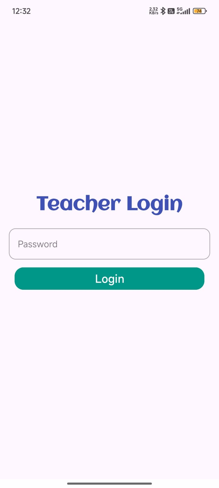
  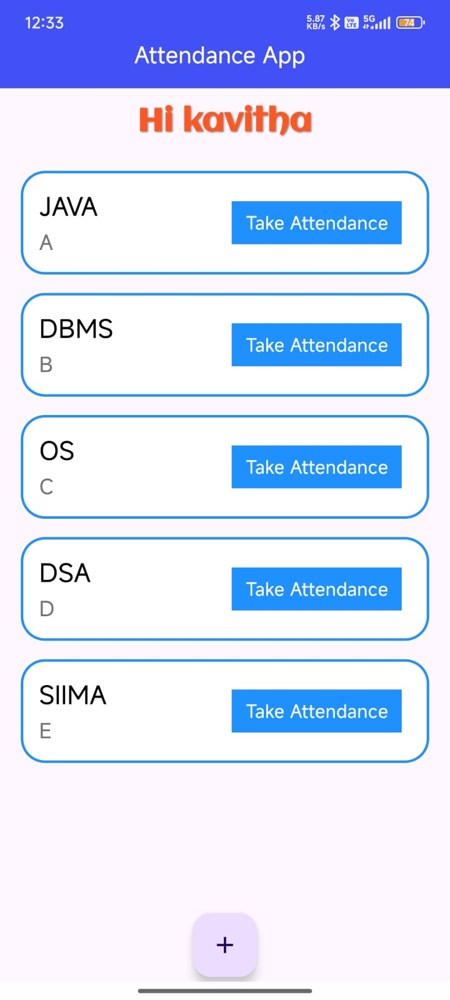
  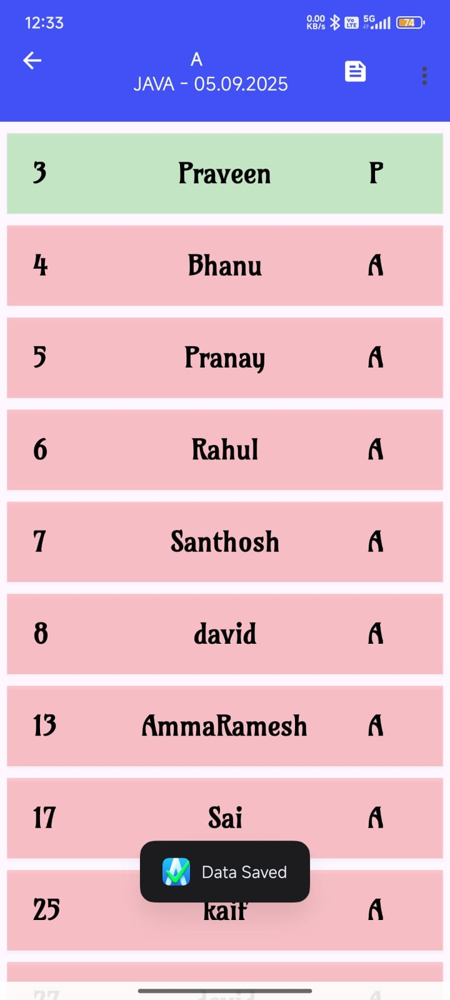

  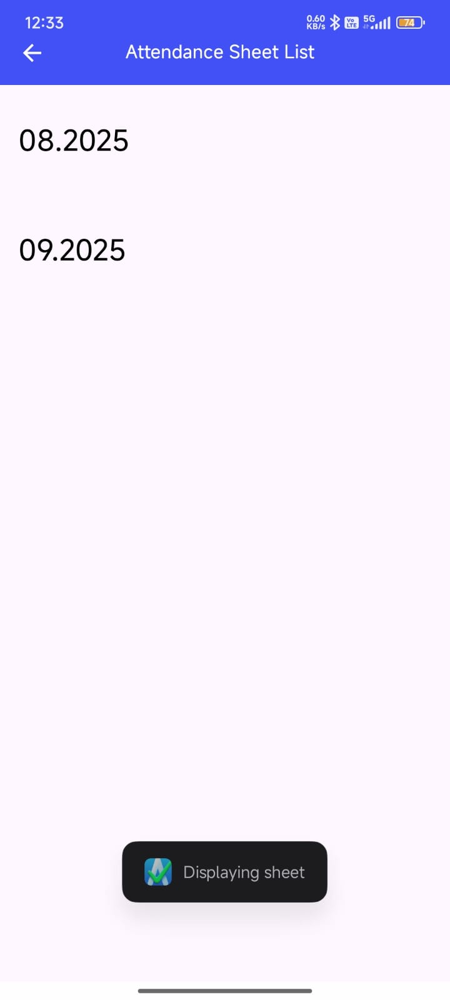
  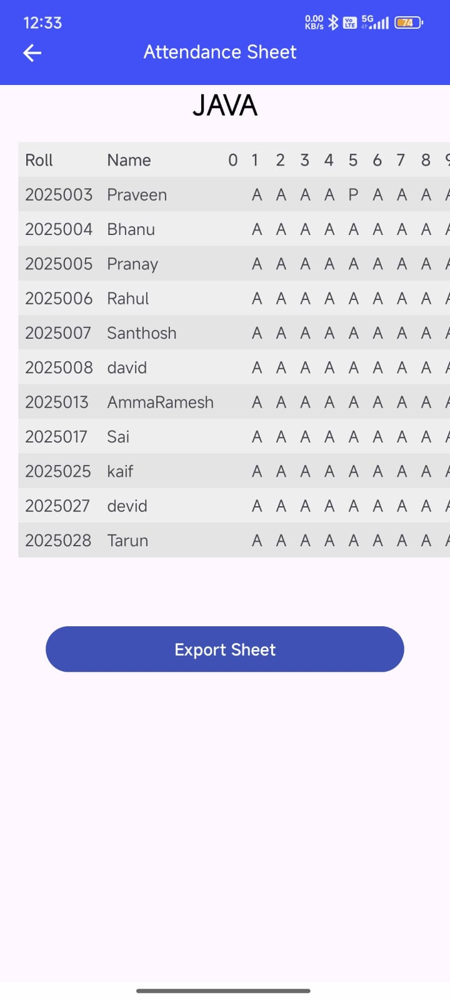
  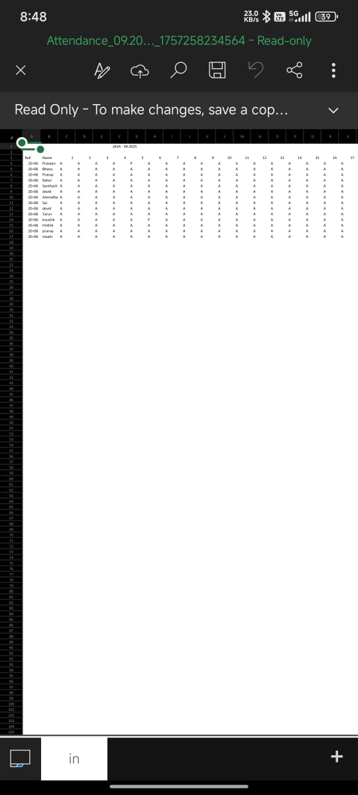

---

<h2 align="center">👩‍🎓 Student Field</h2>

  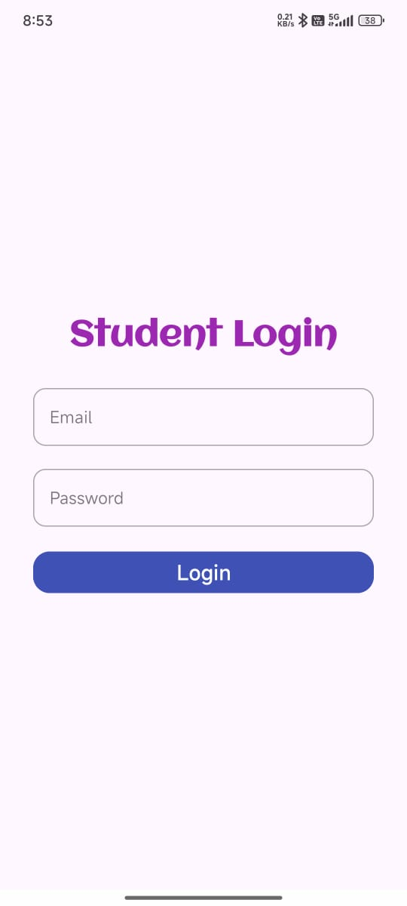
  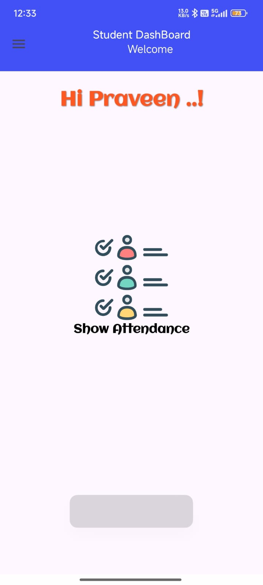
  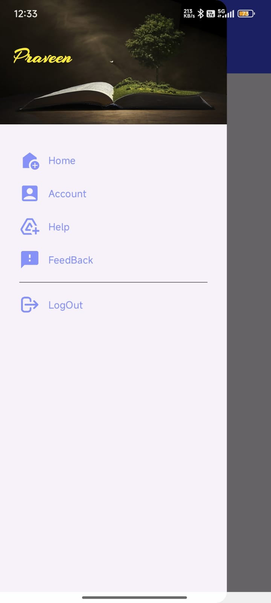

  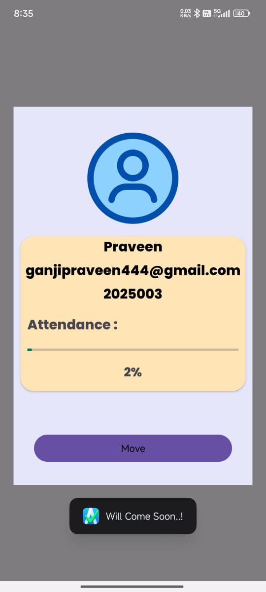
  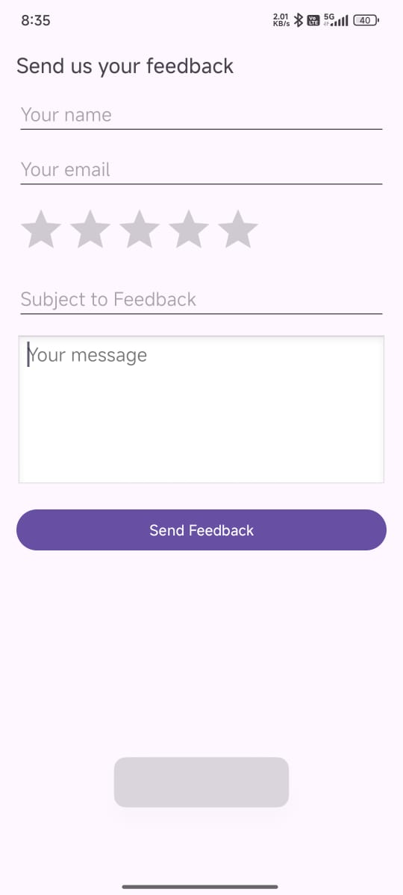
  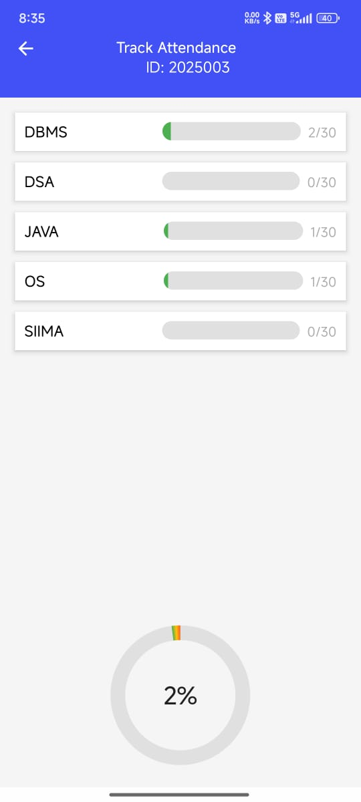

---

<h2 align="center">👨‍💻 About the Developer</h2>

  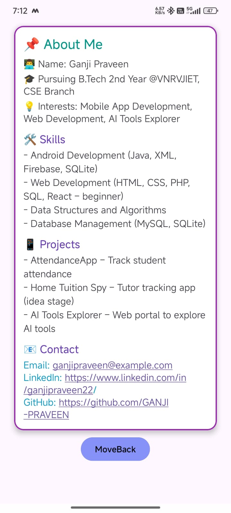

Made with ❤️ by <b>Ganji Praveen</b>

## 📥 Download the App

✨ Get the latest version of **MarkMe-UltimateApp** here:

